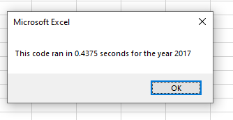
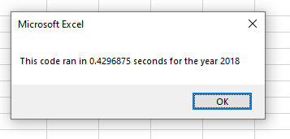

<h1>Stock Analysis</h1>
<h2>Overview</h2>
 The purpose of this project was to create a macro using VBA that calculates stock volume and return rates for a given year (2017/2018).

<h2>Results</h2>
 For the refactored script, the runtime was roughly ~0.08 seconds for 2017 and 2018. In the original VBA script, the runtime was about ~.45 seconds. 
</img>
</img>

<h2>Summary</h2>
 
<ol>
  <li>A great advantage of refactoring the original source code is that one can make improvements upon it (such as improving runtimes, or make it easier for others to read). However, there comes a risk of creating bugs that did exist otherwise (not for this project, but for others).</li>
  <li>One good thing about our original VBA script is that it is simple, and easy to understand for beginners. However, the refactored version of our VBA script is much more efficient and is suited for use with large datasets.</li>
</ol>
