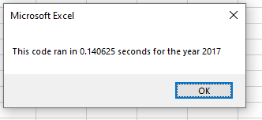
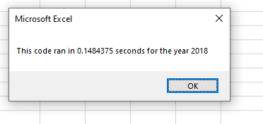

<h1>Stock Analysis</h1>
<h2>Overview</h2>
 The purpose of this project was to create a macro using VBA that calculates stock volume and return rates for a given year (2017/2018).

<h2>Results</h2>
 Overall, the performance between the years 2017 and 2018 were about the same (~.44 seconds on my machine) after refactoring (~.48 seconds with the original script). 
</img>
</img>
However, I was able to write my own version of the code which had a runtime of ~.15 seconds for both years.

<h2>Summary</h2>
 
<ol>
  <li>A great advantage of refactoring the original source code is that one can make improvements upon it (such as improving runtimes, or make it easier for others to read). However, there comes a risk of creating bugs that did exist otherwise (not for this project, but for others).</li>
  <li>One good thing about our original script is that it is simple, and easy to understand. However, the refactored version of our VBA script has a slightly smaller runtime than the original.</li>
</ol>
