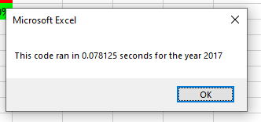
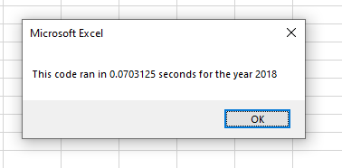

<h1>Stock Analysis</h1>
<h2>Overview</h2>
 In this module, we created a VBA macro that that outputs stock volume and return rates for a given year using a spreadsheet. The purpose of this challenge was to refactor this VBA macro to improve its rutime efficiency.

<h2>Results</h2>
<h3>Performance</h3>
As seen in the images below, the stock performance for 2017 had largely positive returns with the exception of TERP. However, in 2018, there was a complete turnaround and only stocks ENPH and RUN saw positive returns.
 
</img>
</img>

<h3>Script Runtimes</h3>
Regarding the runtimes for our VBA scripts, the refactored version had a runtime of roughly ~0.08 seconds for the 2017 and 2018 datasets. In the original VBA script, the runtime was about ~.45 seconds. 
 
</img>
</img>

<h2>Summary</h2>
 
<ol>
  <li>A great advantage of refactoring the original source code is that one can make improvements upon it (such as improving runtimes, or make it easier for others to read). However, there comes a risk of creating bugs that did exist otherwise (in general).</li>
  <li>One good thing about our original VBA script is that it is simple, and easy to understand for beginners. However, the refactored version of our VBA script is much more efficient and is suited for use with large datasets.</li>
</ol>
